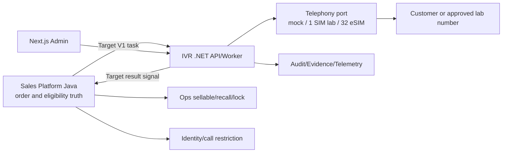

# ARCH-01 — System Context

Trạng thái: `TARGET_V1_DRAFT`.

Sales aggregates eligibility into the task and revalidates on callback. IVR never calls Ops/CRM to decide order state, never transitions an order and never sends a customer notification. Lab calls use approved test numbers only.
