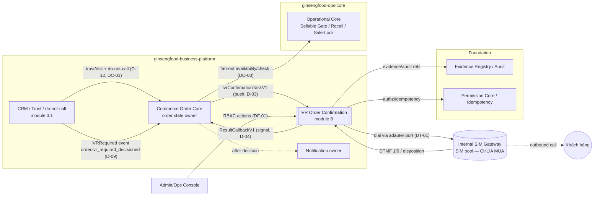

# ARCH-01 — System Context

Trạng thái: `SRS_DRAFT` · Sinh bởi: `p08` · Nguồn: `phase-8/02`,`/10`; docx §1,§3,§18.

IVR Order Confirmation là **downstream consumer** của Commerce Order Core; kết nối privacy-safe với các hệ khác. IVR result = input signal; Order Core quyết định.

## Boundary chốt
- **Order Core** cấp task + nhận callback + revalidate (gọi ops fan-out); **owner order state**.
- **Ops** chỉ trả SellableStatus theo SKU/batch (Core gọi, không phải IVR) — DO-CORR-1.
- **CRM/business-platform** cấp trust/risk (D-12) và **do-not-call** (✅ DC-01; rich fields/Core wiring theo IR-CRM-01).
- **Notification** chỉ sau Core decision — IVR không tự gửi.
- **SIM** qua adapter port; chưa mua → mock. `CUST` chỉ được gọi thật sau release gate (DF-03).
