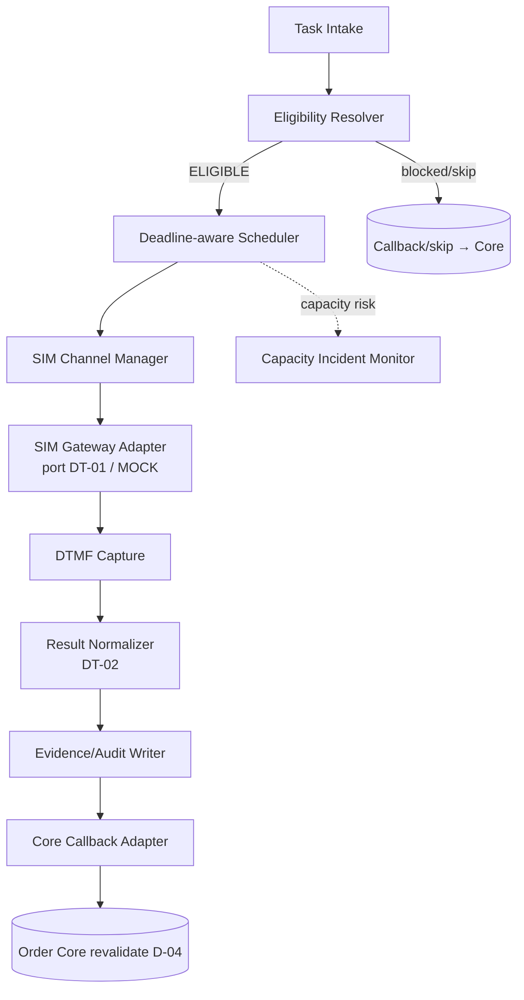

# ARCH-02 — Module Boundaries (Service Blocks)

Trạng thái: `SRS_DRAFT` · Sinh bởi: `p08` · Nguồn: `phase-8/13` (services), `/10`; docx §3,§10.

## 1. Service blocks nội bộ IVR
| Block | Trách nhiệm | Ghi/đọc | Ranh giới |
| --- | --- | --- | --- |
| **Task Intake Service** | Nhận `IvrConfirmationTaskV1`, validate (allowlist/idempotency/official-order/policy/contact/blocker/script), tạo CallJob | `ivr_confirmation_tasks`, `ivr_call_jobs` | Chỉ Order Core (DF-06); không ghi order |
| **Eligibility Resolver** | Consume trust/contact/blocker snapshot + program/window/capacity → decision (trusted skip D-12) | `ivr_call_jobs.eligibility_*` | Không hardcode trust; không override blocker |
| **Deadline-aware Scheduler** | Rolling queue theo deadline; attempt policy D-10; ưu tiên GH/near-expiry/attempt2/risk | `ivr_call_attempts`, `ivr_capacity_incidents` | Không batch cuối phiên; không tạo attempt>2 |
| **SIM Channel Manager** | Reserve/lock SIM, health, cooldown 5s, fail≥3→disable | `ivr_sim_channels` | ONE_SIM_ONE_ACTIVE_CALL |
| **SIM Gateway Adapter (port DT-01)** | dial/play/capture DTMF/disposition/health; `adapter_mode=MOCK|REAL` | `ivr_raw_call_event` | **Không** cred ghi order, không SMS; không lưu raw phone |
| **Result Normalizer** | Raw → result_type (DT-02); tách technical≠no-answer | `ivr_call_results` | Không để raw event vào Core |
| **Core Callback Adapter** | Gửi `ResultCallbackV1` ra Order Core (D-04); retry bounded cùng idempotency | `ivr_result_callbacks` | Không tự transition order |
| **Evidence/Audit Writer** | Ghi evidence/audit refs mọi bước | `ivr_evidence_links`, refs | Không tự mark accepted (DF-03) |
| **Admin Monitoring API** | Queue/SIM/incident/review; RBAC | `ivr_admin_actions` | Không force order/bypass blocker |
| **Capacity Incident Monitor** | Phát hiện nghẽn, mở incident | `ivr_capacity_incidents` | Không im lặng để đơn hết hạn |

## 2. Luồng nội bộ (rút gọn)
`Intake → Eligibility → Scheduler → SIM Manager → Adapter → DTMF → Normalizer → Evidence → Callback → (Order Core revalidate)`.

## 3. Nguyên tắc tách boundary
- Mỗi block có thể deploy chung service nhưng **ranh giới quyền tách bạch**: Adapter không quyền order/DB nghiệp vụ ngoài raw event; Admin API tách khỏi runtime path.
- Order state & blocker realtime **ở Order Core**, không nằm trong block IVR nào (D-02/DO-03).
