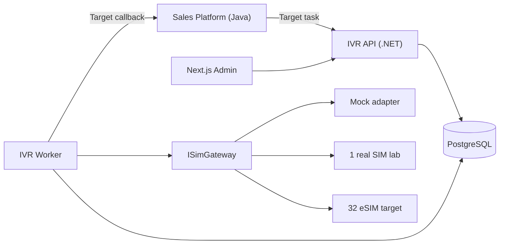

# ARCH-04 — Deployment Architecture

Trạng thái: `TARGET_V1_DRAFT`.

## Environments/modes

- dev/CI: `MOCK`, fake Sales and mock SIM.
- lab: `LAB_REAL_SIM`, one real SIM, destination allowlist, global kill switch, fake/sandbox Sales.
- staging/prod candidate: real Sales APIs remain disabled until contract/auth tests pass.
- production: `PRODUCTION_REAL`, target 32 eSIM after measured capacity and release approval.

Channel pool size/concurrency/cooldown are runtime config. Deployment readiness, adapter health and `REAL_CUSTOMER_CALL_ALLOWED` are separate gates. Recording is off; secrets are external; network policies allow only approved Sales/identity/telephony endpoints.
