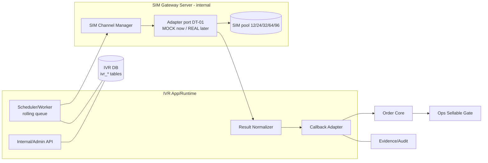

# ARCH-04 — Deployment Architecture

Trạng thái: `SRS_DRAFT` · Sinh bởi: `p08` · Nguồn: `phase-8/10`,`/16`; docx §10,§11,§22; DT-01/DT-04.

## 1. Mô hình triển khai (chốt)
- **INTERNAL_SIM_GATEWAY_SERVER** (SIM nội bộ, server nội bộ). `ONE_SIM_ONE_ACTIVE_CALL`.
- Cloud IVR / SIP Trunk / Voice Brandname = **future owner decision** (`NEED_CONFIRMATION`), KHÔNG mặc định (docx §22 P0-01).
- ⏳ **SIM CHƯA MUA** → adapter port (DT-01), `adapter_mode=MOCK` cho dev/test; `REAL` sau khi mua + release gate (DF-03).

## 2. Thành phần triển khai

## 3. Capacity baseline (docx §11)
- Hệ số: `AVG_CALL_DURATION=35s`, `CONSERVATIVE_CYCLE=50s/cuộc/SIM`.

| SIM | ~5 phút | ~15 phút | ~45 phút (rolling) |
| --- | --- | --- | --- |
| 12 | ~72 | ~216 | ~648 |
| 24 | ~144 | ~432 | ~1.296 |
| 32 | ~192 | ~576 | ~1.728 |

- Roadmap: pilot **12** → launch **24–32** → 64 → 96 theo volume. Số thật ⏳ DT-04 (mua SIM).
- Với window ngắn (GH 5′) + volume cao → **rolling real-time queue bắt buộc**, không batch cuối phiên; vượt năng lực → `capacity_incident` (không im lặng).

## 4. Môi trường
- **non-prod**: `adapter_mode=MOCK`, SIM channel `enabled=false`, recording OFF; dry-run smoke (seed p10).
- **prod**: chỉ mở sau release gate (DF-03) + mua SIM + pilot scope owner duyệt. `REAL_CUSTOMER_CALL_ALLOWED=NO` tới khi đó.

## 5. Owner decision hạ tầng còn treo
- SIM protocol (DT-01), số SIM pool launch (DT-04), caller-ID/brandname (DT-06).
