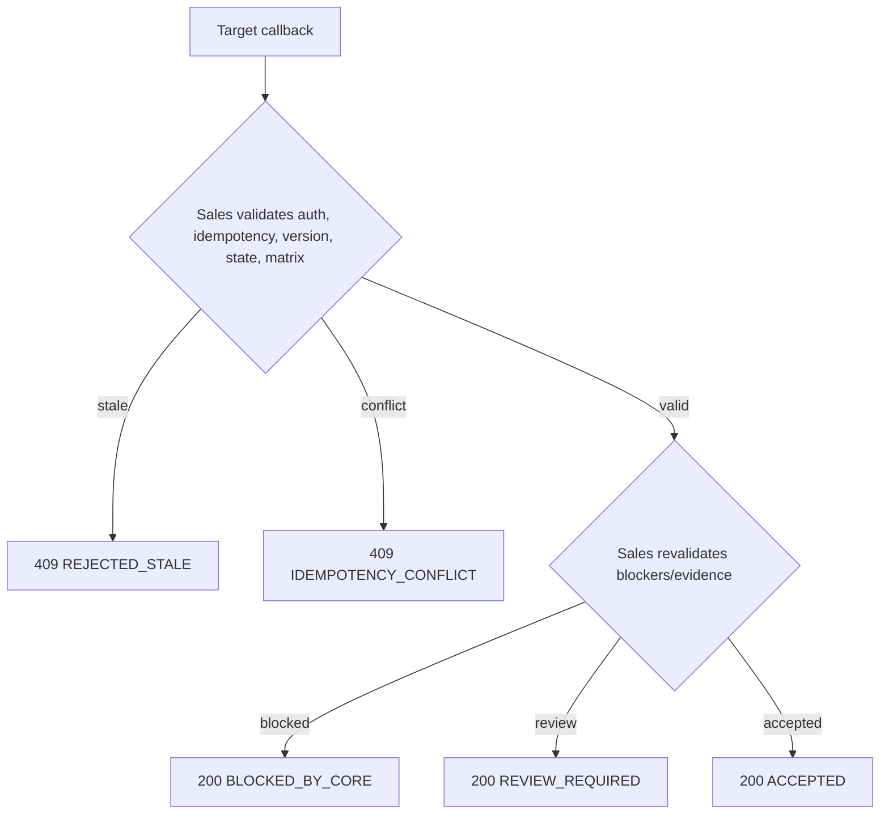
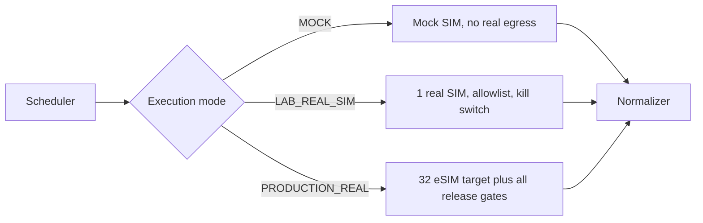

# ARCH-07 — Summary Diagrams

Trạng thái: `TARGET_V1_DRAFT`.

## Callback revalidation

## Mode/provider gate

Attempt offsets come from `attempt_policy_version`; diagrams intentionally do not hard-code candidate timings.
