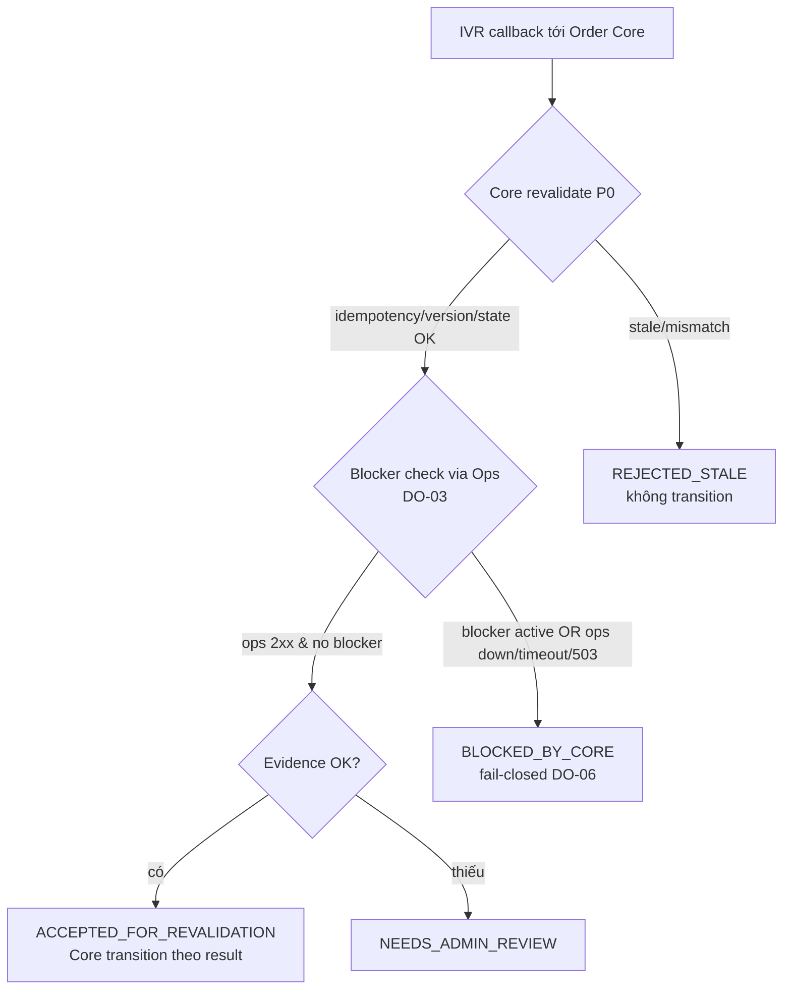
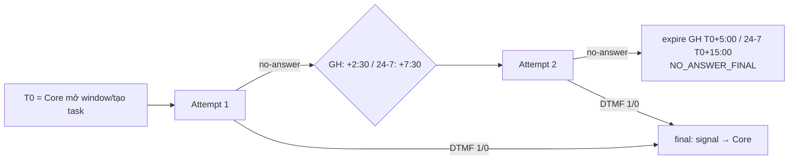
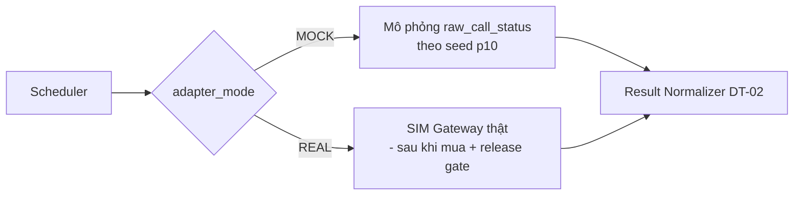

# ARCH-07 — Diagrams (tổng hợp)

Trạng thái: `SRS_DRAFT` · Sinh bởi: `p08`. Diagram context/component/deployment ở `01`,`02`,`04`; workflow/sequence ở `specs/srs/workflows/*`.

## 1. Fail-closed decision (revalidate lúc callback)

## 2. Attempt/scheduler timeline (D-10)

## 3. Adapter mode (SIM chưa mua — DT-01)

## Ghi chú render
- Tất cả block dùng `flowchart`/`sequenceDiagram`/`stateDiagram` chuẩn Mermaid. Không nhúng ký tự đặc biệt gây lỗi parse.
