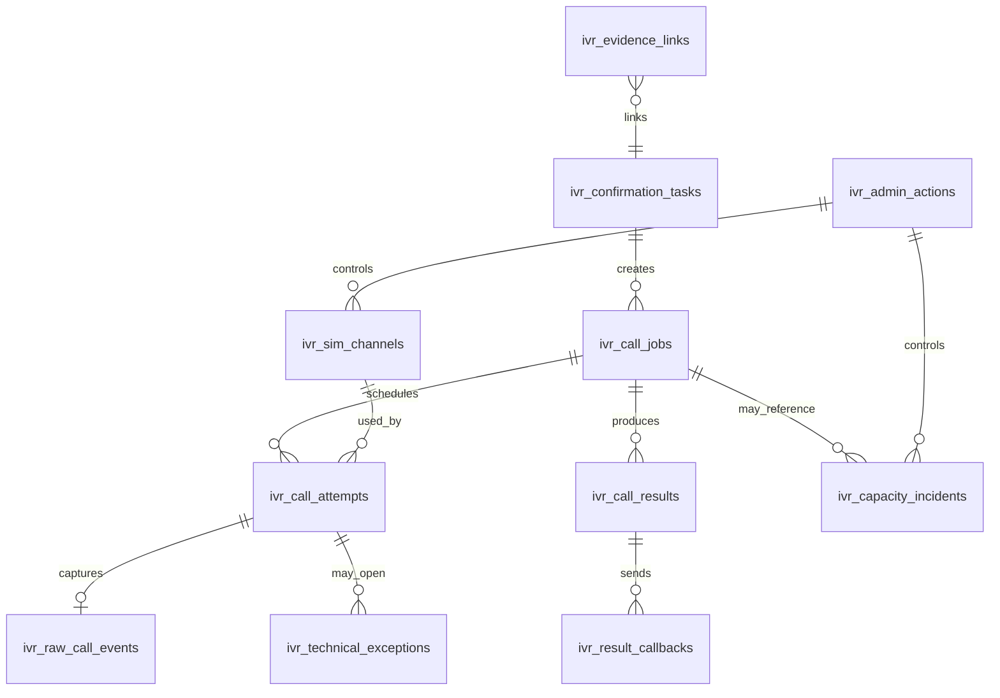

# DB-01 — ERD

Trạng thái: `SRS_DRAFT` · Sinh bởi: `p07` · Nguồn: `phase-8/12` §3 + OD-DR-03 (`ivr_raw_call_events`).

## Quan hệ chính
- 1 task → n call jobs (thường 1); 1 job → n attempts (≤2, D-10); 1 attempt → 0..1 raw_call_event.
- 1 job → n results; 1 result → n callbacks (retry cùng idempotency).
- Technical exception & capacity incident tách riêng để **không** trộn vào customer attempt.
- `ivr_evidence_links` là link table tùy chọn cho evidence/audit refs khi cần query.
- Order state **không** có bảng riêng trong IVR (chỉ snapshot trong task/job/result).

| Bảng | Field chính | Invariant |
| --- | --- | --- |

> **W-0196 / P0.3:** account/session W-0105 được giữ vật lý trong cửa sổ tương thích;
> runtime không đọc/ghi, Module 3 vẫn sở hữu identity. W0122 giữ ID lịch sử nhưng không còn drop;
> migration P03 sửa schema thiếu, không khôi phục dữ liệu đã mất. Cleanup chỉ ở release sau;
> xem [expand-contract](../../docs/database/expand-contract.md).
