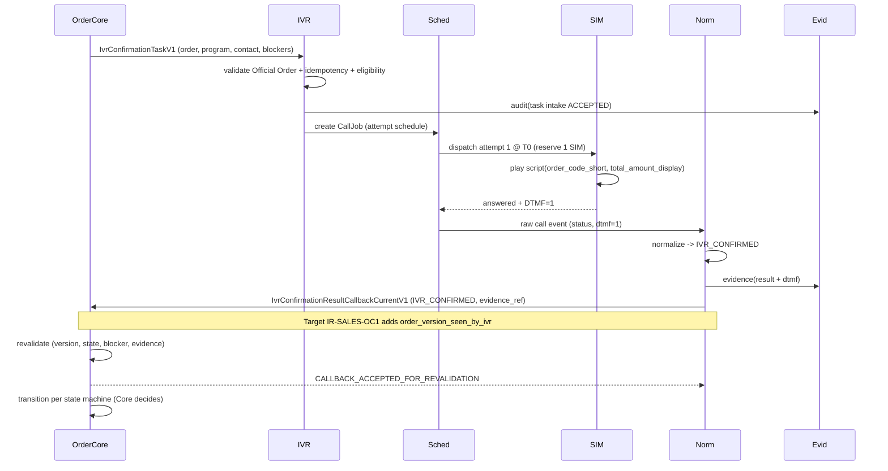

# Workflow — Happy Path (Confirm, phím 1)

Trạng thái: `SRS_DRAFT` · Sinh bởi: `p04` · Nguồn: `docx` §3,§8,§9,§14; `phase-8/07`,`/23`.

**Kết quả:** `IVR_CONFIRMED` (counted, final) → Order Core revalidate → tiếp tục xử lý đơn.

**Ghi chú:** attempt 2 không được tạo vì A1 đã có kết quả cuối (FR-IVR-SCH-005). Core có thể vẫn `BLOCKED_BY_CORE` nếu revalidate phát hiện blocker (xem [06](06-race-condition-revalidation.md)).
