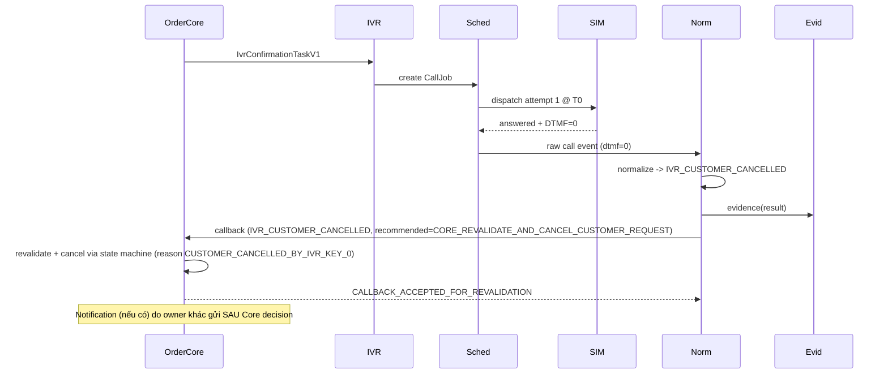

# Workflow — Cancel (phím 0)

Trạng thái: `SRS_DRAFT` · Sinh bởi: `p04` · Nguồn: `docx` §9,§13,§14; `phase-8/07`.

**Kết quả:** `IVR_CUSTOMER_CANCELLED` (counted, final) → Order Core hủy **qua state machine** (IVR không tự hủy).

**P0:** `IVR_CAN_DIRECTLY_CANCEL_ORDER = NO`; hủy phải qua Core (P0-IVR-002). IVR/SIM không tự gửi thông báo (P0-IVR-008).
