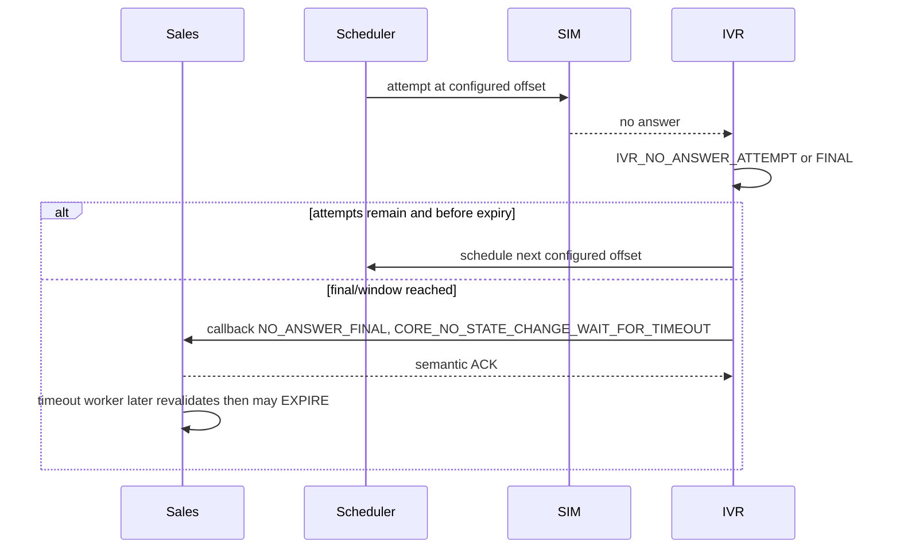

# Workflow — No Answer and Timeout

Trạng thái: `TARGET_V1_DRAFT`.

Scheduler uses the task's approved `attempt_policy_version` and offsets. Candidate for MOCK/LAB only: GH `[0,150]` within 300s; 24/7 `[0,450]` within 900s.

IVR never cancels the order and sends no SMS/notification. Technical failure does not consume a customer attempt.
