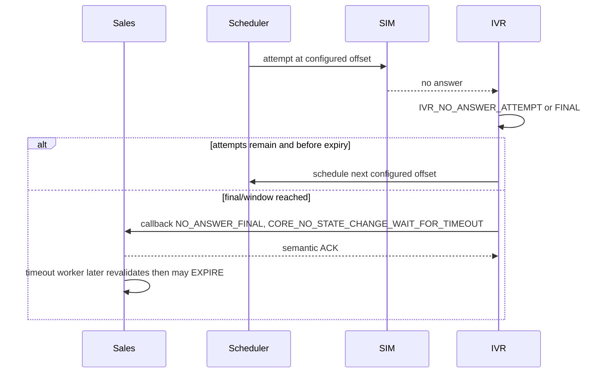

# Workflow — No Answer and Timeout

Trạng thái: `TARGET_V1_DRAFT`.

Scheduler uses the immutable policy snapshot stored when intake accepts the task. Current
`mock-lab-v1` candidate is GH `[0,150]` within 300s and 24/7 `[0,450]` within 900s, max 2;
dev seed enables it only for MOCK, while the dev loader can register it for MOCK/LAB and the lab
seed uses separate `lab-softphone-v1`. None of these is a production approval.

IVR never cancels the order and sends no SMS/notification. Technical failure does not consume a
customer attempt. Current technical retry uses a separate scheduler limit (default 1), can requeue
the same customer-attempt number and has no signed versioned backoff; Product/Order Core/M3 must
close `ATP-04..06` before this is a production workflow. See the
[M8-11 decision pack](../../plan/ivr-orther/m8-11-attempt-policy-production-decision-pack-2026-09-03.md).
