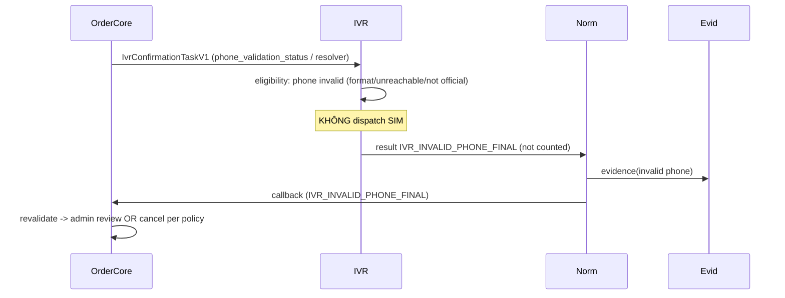

# Workflow — Invalid Phone

Trạng thái: `SRS_DRAFT` · Sinh bởi: `p04` · Nguồn: `docx` §7,§13; `phase-8/03`,`/07`.

**Kết quả:** `IVR_INVALID_PHONE_FINAL` (NOT counted, final) → Core/admin review hoặc cancel theo policy. Phone invalid **KHÔNG** phải no-answer (P0-IVR-005).

> ⚠️ **Thực tế Core (DS-02):** như no-answer/technical, `INVALID_PHONE_FINAL` **không** tự transition order — order ở `CONFIRMING` chờ `timeout→EXPIRED` (trừ khi admin thao tác). "cancel per policy" ở diagram = **advisory/target** (IR-SALES-OC3), Core hiện chưa hủy chủ động.

**Owner Decision:** OD-DR-05 / M8-OD-004 — invalid phone xử lý **cancel** hay **admin review**? Mặc định V0.2: admin review hoặc Core policy. OD-09: tiêu chí permanent invalid phone.
