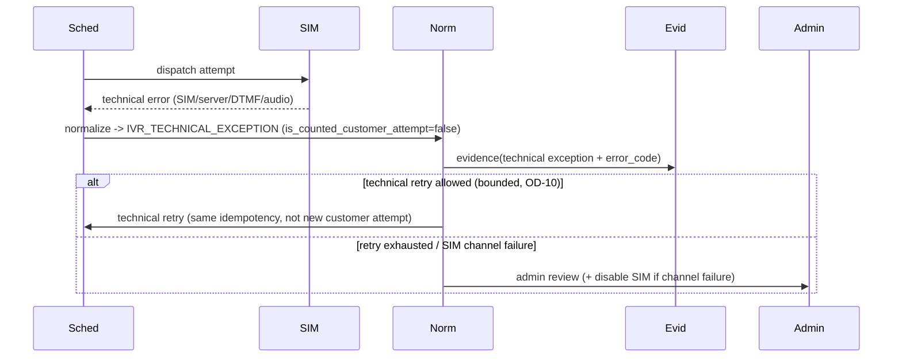

# Workflow — Technical Exception

Trạng thái: `SRS_DRAFT` · Sinh bởi: `p04` · Nguồn: `docx` §15; `phase-8/07`,`/16`.

**Kết quả:** `IVR_TECHNICAL_EXCEPTION` (NOT counted) → technical retry bounded HOẶC admin review. **Lỗi kỹ thuật ≠ khách không nghe** (P0-IVR-004).

**P0:** Không cộng vào customer attempt count; không map thành `IVR_NO_ANSWER_*`. Lỗi callback → retry bounded cùng idempotency. `Owner Decision Required` OD-10 (retry count/backoff), OD-11 (mapping tín hiệu SIM thật).

> **Đối soát code `2026-09-04` (`W-0171`).** Hành vi trên đã thực thi: `delivery_status` đi
> `RETRY_PENDING` → `RETRY_EXHAUSTED`, và DB cấm mọi result kỹ thuật mang
> `is_counted_customer_attempt = true`. Nhưng nhãn `INTERNAL_CALLBACK_ERROR` **không tồn tại
> trong runtime** — `exception_type` là string tự do chứa mã gốc của gateway. Chi tiết và
> owner decision còn mở: `specs/functional/06-technical-exception-capacity.md`.
