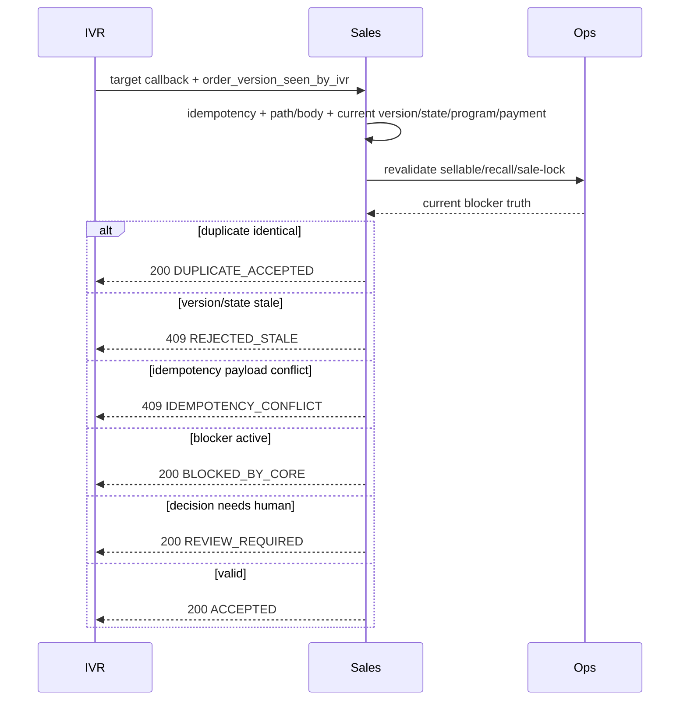

# Workflow — Race Condition and Sales Revalidation

Trạng thái: `TARGET_V1_DRAFT`.

Raw customer signal remains immutable even if Sales blocks it. Current Golden Hour adapter may only provide coarser behavior; its tests/status stay separately labelled `CURRENT_COMPAT`.
