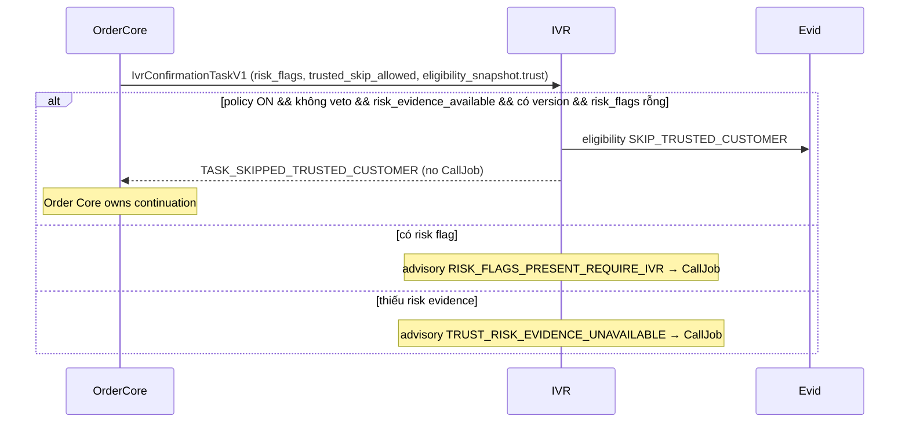

# Workflow — Returning Customer Skip

Trạng thái: `SRS_DRAFT` · Sinh bởi: `p04` · Nguồn: `phase-8/03`; `docx` §7 (M8-OD-002); `phase-8/04 §12`; owner decision `OD-15` (2026-08-25).

**Kết quả:** `TASK_SKIPPED_TRUSTED_CUSTOMER` — không tạo CallJob; Order Core tiếp tục workflow. Tên decision giữ nguyên vì đã nằm trong wire enum và DB check constraint; nghĩa hiện tại là **khách cũ, đơn không có risk flag**.

> **`OD-15` (owner, 2026-08-25) — không gọi IVR cho khách cũ.** Quyết định này **supersede `OD-08`** và phần trust-score của **`D-12`**. Skip **không còn** phụ thuộc `CustomerTrustResolver` mà `DC-06` ghi là chưa build.
>
> **Điều kiện skip (tất cả phải đúng):**
> 1. `IVR_RETURNING_CUSTOMER_SKIP_ENABLED` ≠ `NO` (mặc định ON).
> 2. `trusted_skip_allowed` **không phải** `false` — `false` là veto của Sales cho riêng đơn đó; absent = im lặng, không veto.
> 3. `eligibility_snapshot.trust.risk_evidence_available = true`.
> 4. Có version quy trách nhiệm: `trust.resolver_version`, fallback về `source_version` cấp snapshot.
> 5. `risk_flags` **rỗng**.
>
> **Vì sao không cần trust score:** khách mới đã tự mang cờ `NEW_CUSTOMER` / `VERIFIED_ORDER_COUNT_0` đúng như `COD_FAIL_HISTORY` hay `SUSPICIOUS_DUPLICATE` (xem `seed/customers.sample.json`). Một phép kiểm "list rỗng" trả lời cả hai vế — *có phải khách cũ không* và *đơn có bất thường không* — nên phần Sales còn phải làm rút xuống **đúng một field**: `trust.risk_evidence_available`.

## Ngoại lệ vẫn giữ nguyên (`D-12`)

Khách cũ **vẫn bị gọi** khi đơn mang bất kỳ risk flag nào: COD fail history, nghi trùng đơn, địa chỉ giao rủi ro, phone pattern nghi ngờ, giá trị đơn bất thường, hành vi Giờ Vàng rủi ro, contact vừa đổi. "Không gọi khách cũ" là **mặc định**, không phải miễn trừ khỏi kiểm soát đơn ảo.

## Fail-closed — hướng đóng không đổi

`risk_flags` rỗng có **hai** nguyên nhân không phân biệt được khi nhìn dữ liệu tĩnh: *Sales đã đánh giá và không thấy gì*, và *Sales chưa đánh giá bao giờ*. `risk_evidence_available` là thứ duy nhất tách được hai trường hợp đó. Thiếu nó → **vẫn gọi**.

Giữ nguyên bất đối xứng với `voice_restriction`: thiếu bằng chứng do-not-call thì **chặn gọi**; thiếu bằng chứng risk thì **vẫn gọi**. Cả hai đều fail-closed, đóng ngược chiều nhau vì thiệt hại khác nhau — một bên là cuộc gọi tới người đã từ chối, bên kia là đơn ảo không được xác minh.

## Advisory codes (không bao giờ block)

| Code | Nghĩa |
| --- | --- |
| `TRUSTED_CUSTOMER_SKIP` | Đã skip — khách cũ, đơn sạch. |
| `RISK_FLAGS_PRESENT_REQUIRE_IVR` | Sales đã đánh giá và có flag → gọi. Đây là nhánh bình thường của khách mới. |
| `TRUST_RISK_EVIDENCE_UNAVAILABLE` | Sales chưa gửi `risk_evidence_available` → gọi. **Đây là tín hiệu theo dõi gap `DC-06`:** còn thấy code này nghĩa là Sales chưa bật field. |
| `TRUST_SKIP_VETOED_BY_SALES` | `trusted_skip_allowed=false` cho đơn này. |
| `TRUST_SKIP_DISABLED_REQUIRE_IVR` | `IVR_RETURNING_CUSTOMER_SKIP_ENABLED=NO` — tắt bằng config, không phải gap upstream. |
| `TRUST_RESOLVER_VERSION_MISSING` | Không có version nào quy trách nhiệm được cho quyết định skip. |
| `TRUST_RESOLVER_UNAVAILABLE` | **Không còn phát ra từ `OD-15`.** Giữ trong vocabulary để đọc được các evidence row ghi trước quyết định. |

## Trạng thái vận hành hiện tại

Bật cờ chính sách **không tự nó skip ai**. Chừng nào Sales chưa gửi `trust.risk_evidence_available`, mọi task đủ điều kiện vẫn được gọi và mang advisory `TRUST_RISK_EVIDENCE_UNAVAILABLE`. Đó là cách đo tiến độ đóng gap: khi advisory này biến mất khỏi log, Sales đã bật field.

**Rollback:** đặt `IVR_RETURNING_CUSTOMER_SKIP_ENABLED=NO` → quay lại gọi tất cả, không cần redeploy.

**Backing tests:** `UT-ELIG-TRUST-16` (từng phần bằng chứng thiếu → vẫn gọi, kèm lý do), `UT-ELIG-TRUST-18` (list rỗng chỉ là skip khi Sales nói đã đánh giá), `UT-ELIG-TRUST-19` (khách mới bị gọi vì `NEW_CUSTOMER` là risk flag), `IT-ELIG-TRUST-14` (skip end-to-end, không tạo CallAttempt), `IT-ELIG-TRUST-15` (risk flag và thiếu evidence đều giữ cuộc gọi).
