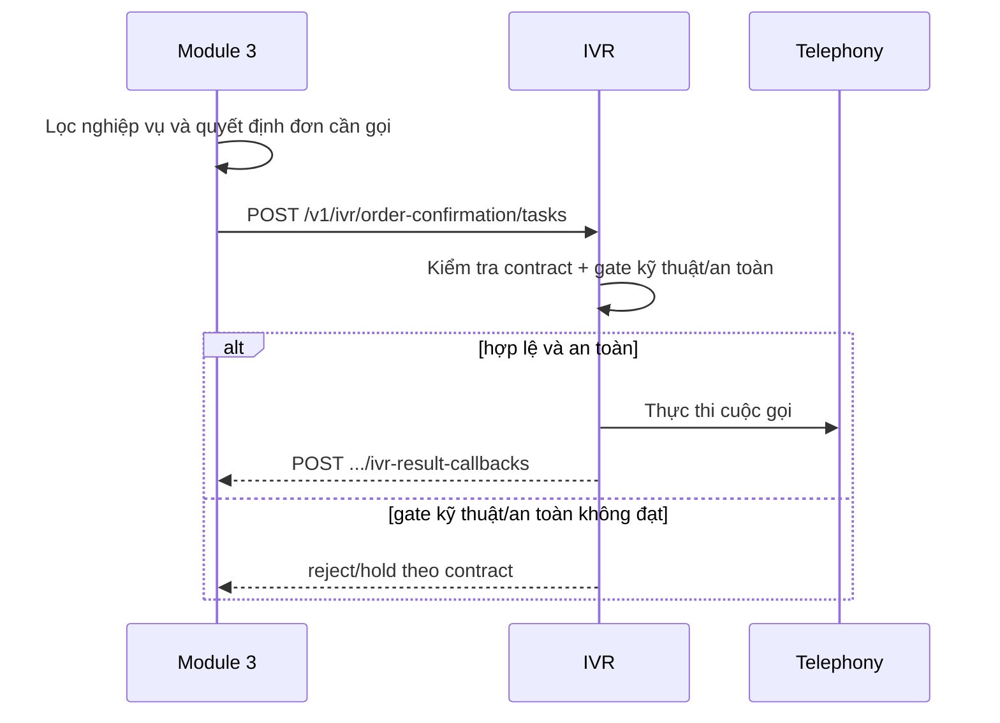

# WF-07 — M3 authoritative call decision

Trạng thái: `SUPERSEDED` cho workflow trusted-skip cũ · Authority hiện hành: `OD-18`.

> **Tên file `07-trusted-skip.md` được giữ nguyên làm ID tài liệu ổn định**, không phải vì nội
> dung còn mô tả trusted skip. `workflows/07` đang được `specs/api/06-error-codes.md`,
> `specs/workflows/00-index.md` và các evidence/tracker lịch sử (`W-0118`, `W-0123`) trỏ tới;
> đổi tên sẽ làm hỏng chính những bản ghi audit không được phép viết lại. Đây cùng một lý do
> giữ enum `TASK_SKIPPED_TRUSTED_CUSTOMER`: tên là tham chiếu đã persist, nội dung mới nằm
> ngay bên dưới (`W-0124` F5).

## Quy tắc hiện hành

Module 3 quyết định nghiệp vụ đơn nào cần gọi. Khi Module 3 gửi một
`IvrConfirmationTaskV1` hợp lệ tới IVR, task đó là **chỉ thị thực thi cuộc gọi**; IVR không phân
loại lại khách cũ/khách mới và không bỏ gọi dựa trên trust metadata hay `risk_flags`.

IVR vẫn giữ các gate kỹ thuật/an toàn thuộc phạm vi của mình:

- service auth, idempotency và schema;
- official contact/dial token và privacy-safe speech;
- `call_restriction`/do-not-call;
- window, policy, script, capacity và runtime kill switch.

`risk_flags` chỉ phục vụ audit/scheduler priority. Các field trust cũ được chấp nhận trong cửa sổ
rolling compatibility nhưng bị bỏ qua bởi active eligibility.

## Legacy compatibility

- `TASK_SKIPPED_TRUSTED_CUSTOMER`: `LEGACY_READ`; runtime từ OpenAPI `draft.21` không emit.
- `trusted_skip_allowed`, `customer_trust_status` và `trust.risk_evidence_available`:
  `LEGACY_READ`, deprecated/ignored; Module 3 không phải gửi để IVR quyết định gọi.
- DB enum/cột/status cũ được giữ để đọc history và rollback; không tạo skip row mới.

Workflow trusted-skip theo `OD-15` là `SUPERSEDED` bởi `OD-18`. Evidence lịch sử nằm tại
[`W-0118`](../../docs/evidence/W-0118/README.md); cutover hiện hành nằm tại
[`W-0123`](../../docs/evidence/W-0123/README.md).
