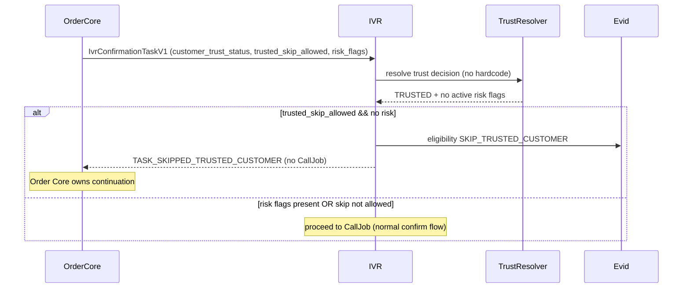

# Workflow — Trusted Customer Skip

Trạng thái: `SRS_DRAFT` · Sinh bởi: `p04` · Nguồn: `phase-8/03`; `docx` §7 (M8-OD-002); `phase-8/04 §12`.

**Kết quả:** `TASK_SKIPPED_TRUSTED_CUSTOMER` — không tạo CallJob; Order Core tiếp tục workflow. Không hardcode trusted (P0).

> ⚠️ **Thực tế hiện tại (DC-06): trusted-skip ĐANG DISABLED.** `CustomerTrustResolver` **chưa được build** (CRM/business-platform) → không có nguồn `trusted_skip_allowed`/`risk_flags` đáng tin. Fail-safe theo D-12: **default require-IVR** (mọi task đủ điều kiện đều gọi, không skip). Flow dưới đây là **target** — kích hoạt khi DC-06 xong (out-of-scope P3.2). Đây là tối ưu, **không chặn** gọi thật.

**Owner Decision:** OD-08 — ngưỡng trusted + danh sách risk flags buộc trusted vẫn phải IVR. Trust unavailable → không tự hardcode; route review / require IVR theo policy an toàn (phase-8/00 §12).
