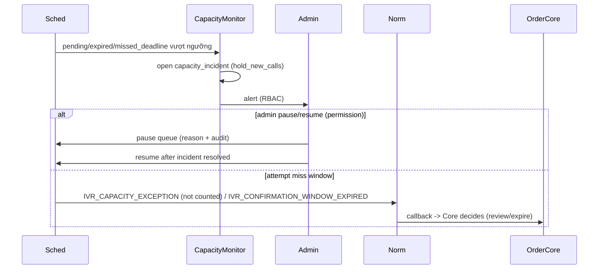

# Workflow — Capacity Hold / Incident

Trạng thái: `SRS_DRAFT` · Sinh bởi: `p04` · Nguồn: `docx` §11,§12; `phase-8/05`,`/07 §10`.

**Tình huống:** Queue/SIM không đủ để dispatch trước expiry. Mở `capacity_incident`, **không im lặng** để đơn hết hạn. Không kéo dài window thương mại.

**P0:** `BATCH_AFTER_SESSION_CALLING = PROHIBITED`; `ROLLING_REAL_TIME_IVR = REQUIRED` (docx M8-SCH-001/002). Miss deadline không log → FAIL. Resume khi incident chưa xử lý → chặn (FR-IVR-ADM-002). `Owner Decision Required` OD-05 (SIM pool size để giảm capacity incident).
