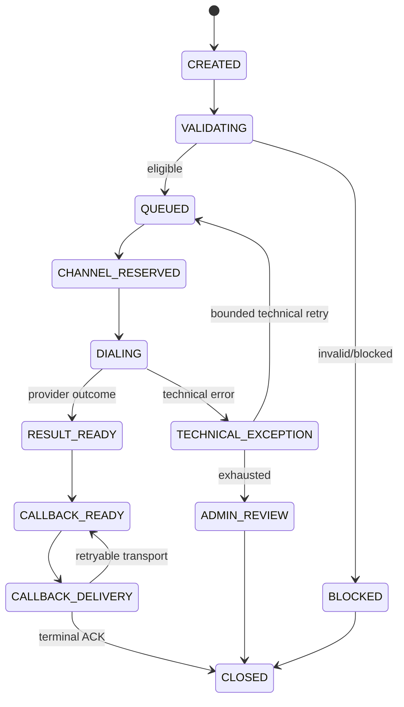

# Workflow — IVR State Machines

Trạng thái: `TARGET_V1_DRAFT`. Order state machine is intentionally absent; Sales owns it.

## Job/attempt

## Callback delivery states

`READY → SENDING → DELIVERED_ACCEPTED | DELIVERED_BLOCKED | DELIVERED_REVIEW | REJECTED_STALE | IDEMPOTENCY_CONFLICT | INVALID_DEAD_LETTER`; retryable transport goes `RETRY_PENDING → SENDING`, then `RETRY_EXHAUSTED` if bounded retries end.

No-answer terminal callback uses no-state-change/wait-for-timeout. Notification is not a state because V1 notification is disabled.
