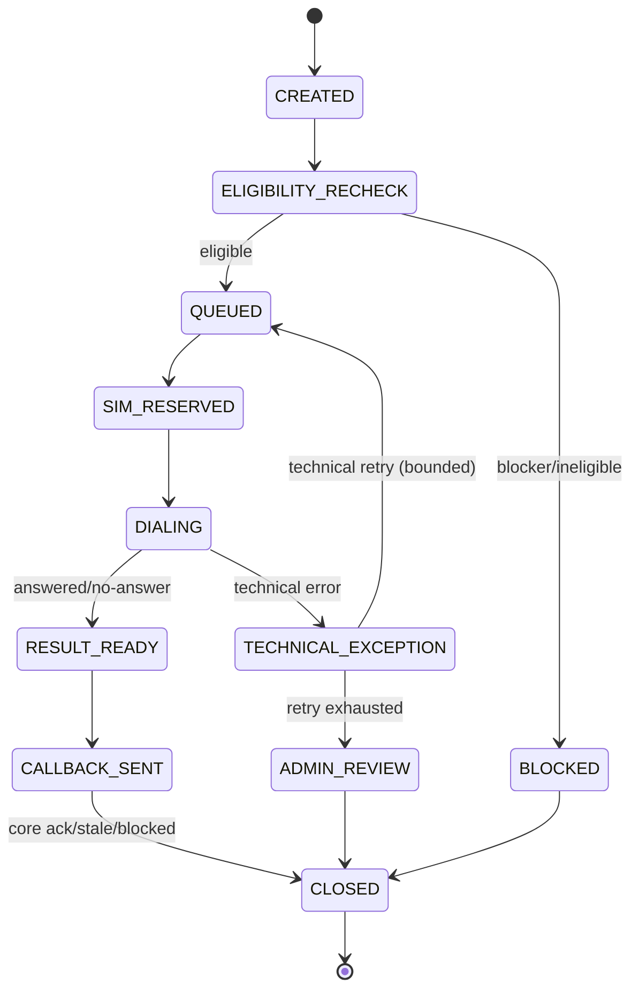
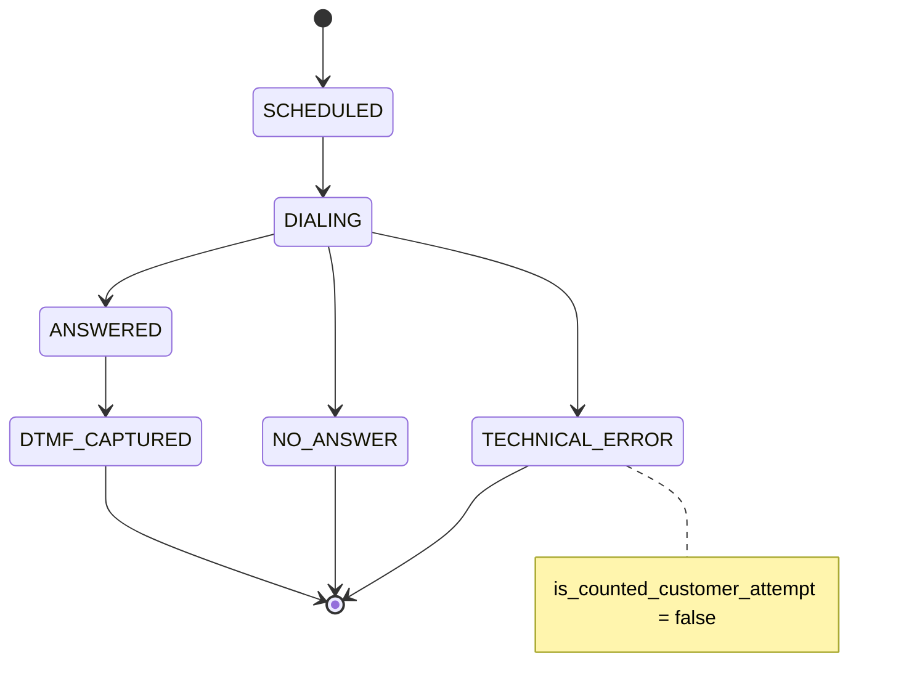
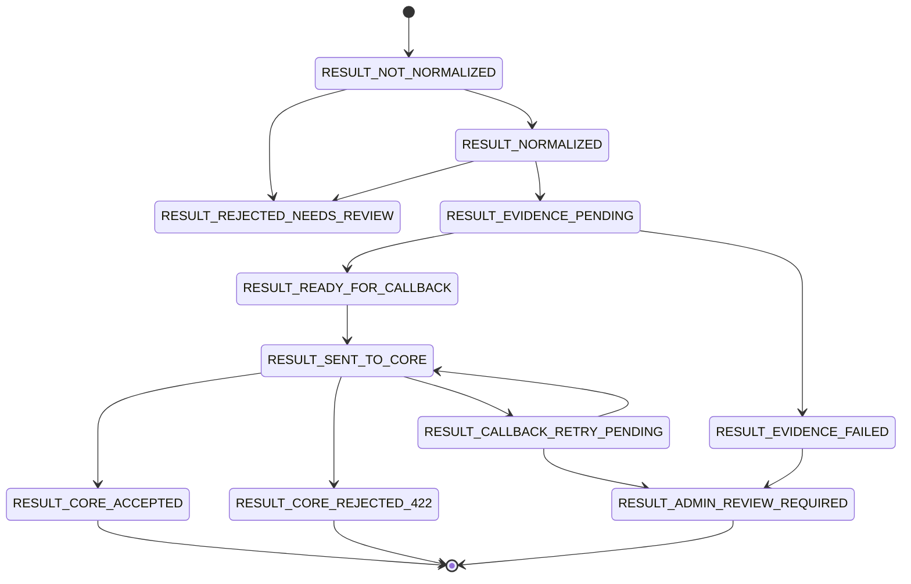

# Workflow — State Machines

Trạng thái: `SRS_DRAFT` · Sinh bởi: `p04` · Nguồn: `phase-8/07 §7` (result), `phase-8/12` (job/attempt), `docx` §3 (pipeline). Data model: `Owner Decision Required` OD-DR-03.

## 1. CallJob state (đề xuất — hợp nhất docx §3 + phase-8/12)

## 2. Attempt state

## 3. Result state (phase-8/07 §7)

Current state uses `RESULT_CORE_REJECTED_422` for Core `422` invalid state/COD/sellable. Target IR-SALES-OC1/OC2 may split this into `RESULT_CORE_REJECTED_STALE` plus blocked/review semantic outcomes.

## 4. Callback core-response (phase-8/07 §12; current/target)
Current Core response: HTTP `200` accept or `422` invalid state/COD/sellable.

Target IR-SALES-OC2 semantic codes: `CALLBACK_ACCEPTED_FOR_REVALIDATION` · `CALLBACK_REJECTED_STALE` · `CALLBACK_BLOCKED_BY_CORE` · `CALLBACK_NEEDS_ADMIN_REVIEW` · `CALLBACK_TECHNICAL_RETRY_ALLOWED` · `CALLBACK_TECHNICAL_RETRY_BLOCKED`.

## Ghi chú
- CONFIRMED: Order state KHÔNG nằm trong state machine của IVR — IVR chỉ lưu snapshot/version. Nguồn: phase-8/12 §2.
- ✅ **Q-S1 → D-02/DS-01 (LOCKED):** IVR **không** giữ/suy diễn state machine đơn — chỉ snapshot. `order_status` thật + IVR-callable rule = **`CONFIRMING` + COD** (DS-01).

### Order Core order transition thật (DS-02 — nguồn: OrderStateMachineImpl)
| IVR result | Order Core |
| --- | --- |
| `IVR_CONFIRMED` | `CONFIRMING → CONFIRMED` (COD; **không** set PAID/paid_at) |
| `IVR_CUSTOMER_CANCELLED` | `CONFIRMING → CANCELLED` (COD; release inventory) |
| `IVR_CONFIRMATION_WINDOW_EXPIRED` | `timeout: CONFIRMING → EXPIRED` (khi qua `expires_at`) |
| `IVR_NO_ANSWER_FINAL` | **Không transition order** — chỉ `ivr_call_queue.call_status=CANCELLED, stop_reason=NO_ANSWER`; order chờ `timeout→EXPIRED` |
| `IVR_TECHNICAL_EXCEPTION` | **Không transition** — queue `stop_reason=FAILED`; không có `HOLD` |
| `IVR_OPERATIONAL_BLOCKED` | **Không transition** — không có `HOLD/BLOCKED` |

- ⚠️ **DS-03:** Core nhận result chỉ khi `CONFIRMING`+COD; else non-timeout → **`422`**. **Chưa có** `CALLBACK_REJECTED_STALE`.
- ⚠️ **DS-04:** `order_version` chưa expose; callback không nhận `order_version_seen_by_ivr` → **race-guard là GAP** (cần Core expose — xem integration-requirements).
- ⏳ Còn treo: OD-DR-03 (tên bảng/model IVR nội bộ), OD-DR-02 (ID/naming scheme) — không chặn.
